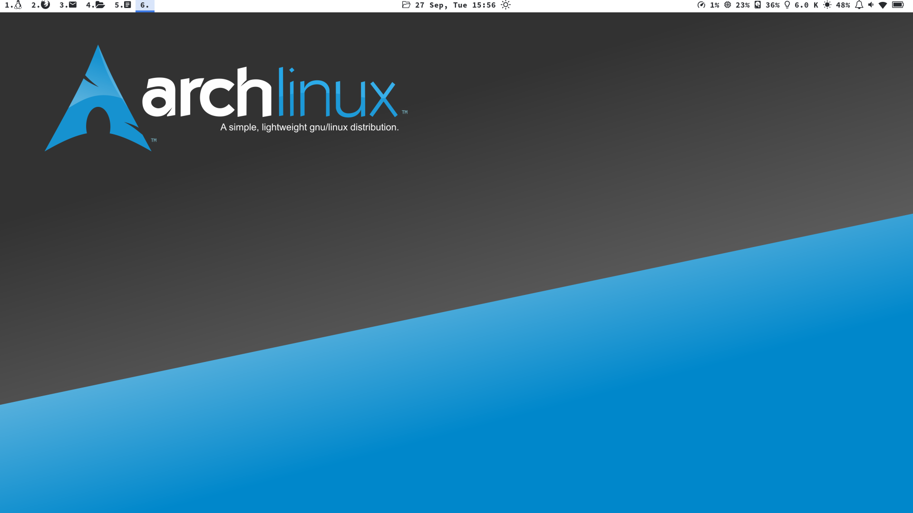
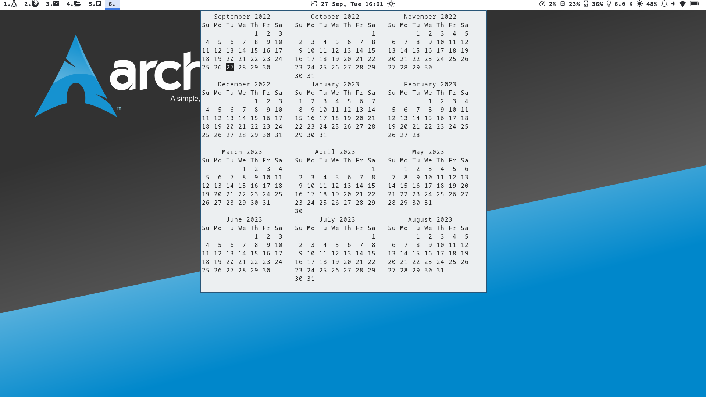
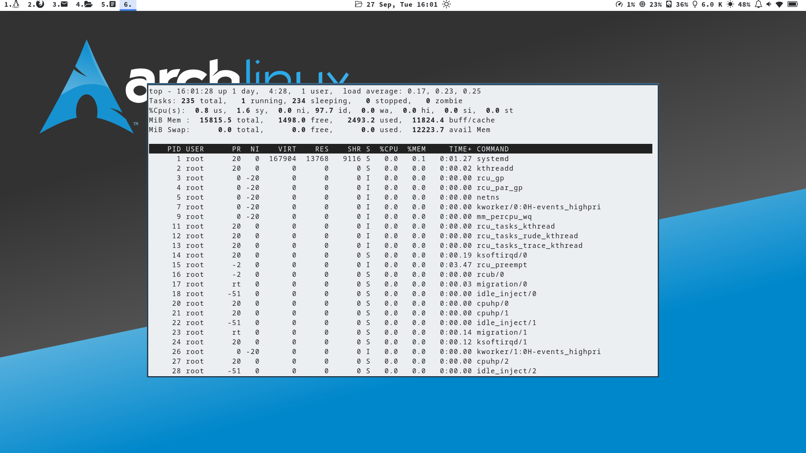
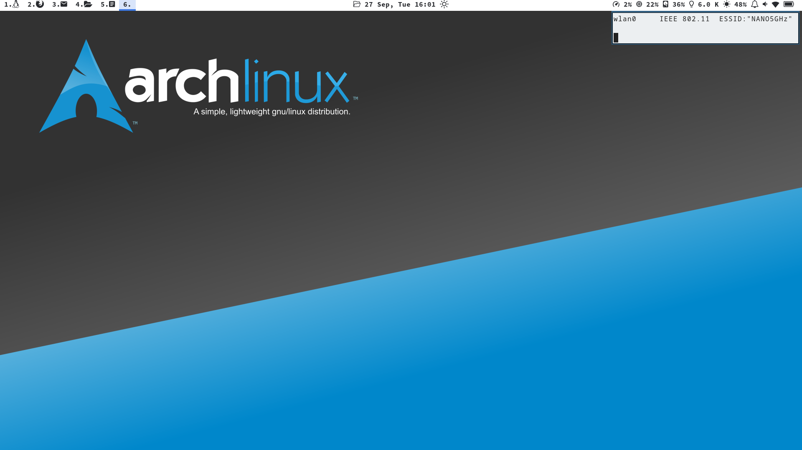
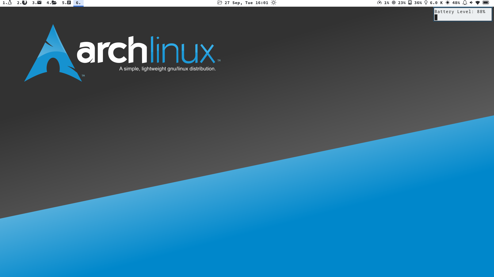

# Just my config files for i3wm and polybar 

Also, it contain my own scripts to show information in polybar. Check some screenshots of my system using this setup.

# My Desktop

# My 'tooltips' in date, CPU, wifi, and battery icons.

 

 

