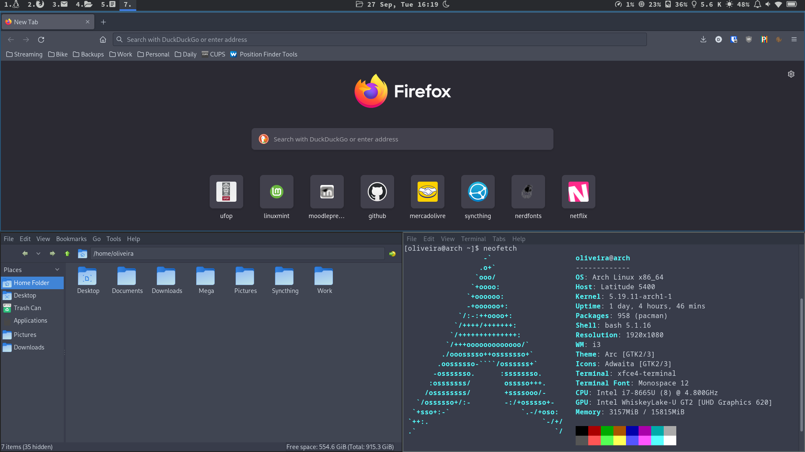
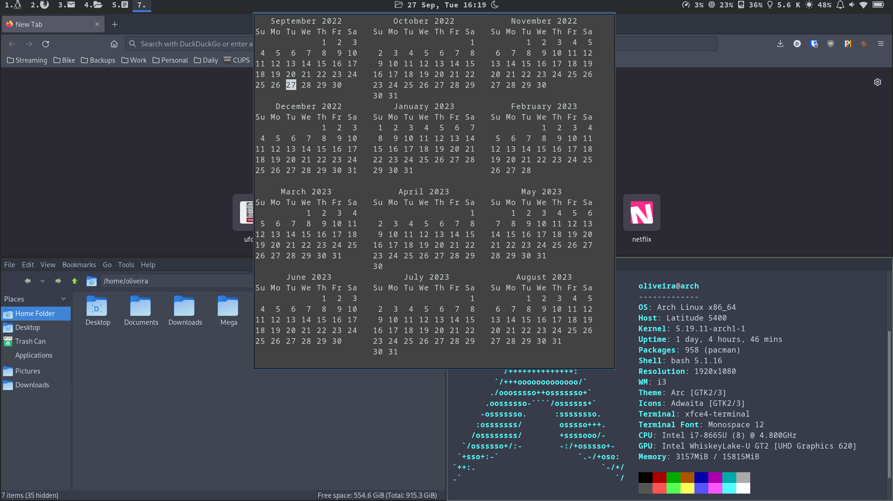

# Just my config files for i3wm and polybar 

Also, it contain my own scripts to show information in polybar. Check some screenshots of my system using this setup.

# My Desktop

# My 'tooltips' in date, CPU, wifi, and battery icons.

 

 

# Auto Toggle Light/Dark mode

Something I am happy to have accomplisehd is my code for Auto Dark Mode at night and Light Mode during the day (check the myautodar.rb code into scripts). Check some prints below with Dark Mode on.

